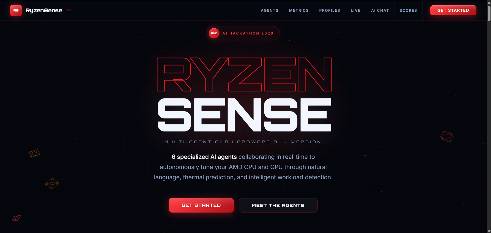
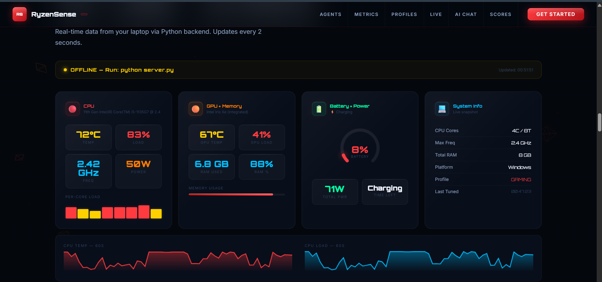
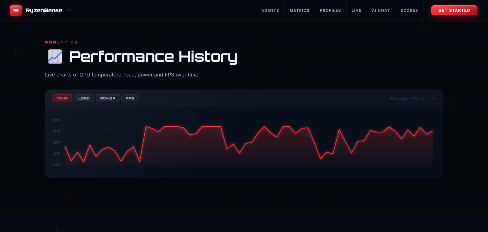
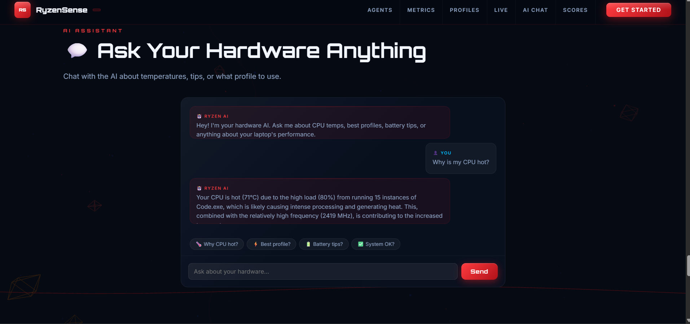

<div align="center">



# RyzenSense  — AMD AI Hardware Performance Tuner

**6 specialized AI agents working together to tune your AMD CPU and GPU in real-time**

[](https://python.org)
[](https://amd.com)
[](https://console.groq.com)
[](https://flask.palletsprojects.com)
[](https://threejs.org)
[](LICENSE)

Tune your AMD hardware through natural language. Instead of manually tweaking TDP limits and clock speeds, just say **"gaming mode, stay under 85°C"** and 6 AI agents handle the rest — monitoring thermals, predicting spikes, detecting running games, and applying the optimal Windows power plan automatically.

[Quick Start](#-quick-start) · [Features](#-features) · [Architecture](#️-architecture) · [Screenshots](#-screenshots) · [Agents](#-the-6-agents)

</div>

---

## Key Highlights

✅ **Natural Language Hardware Tuning** — describe your goal, AI figures out the settings

✅ **6 Specialized AI Agents** — each with a distinct role, communicating via event bus

✅ **Real-Time Telemetry** — live CPU/GPU/battery/RAM metrics every second

✅ **Thermal Prediction** — forecasts temperatures 30 seconds ahead, acts pre-emptively

✅ **Game Auto-Detection** — switches to Gaming profile automatically when a game is launched

✅ **Schedule Profiles** — auto-switch power profiles at specific times of day

✅ **Smart Alerts** — browser notifications when CPU overheats or battery is critical

✅ **AI Chat Assistant** — ask your hardware anything in plain English

✅ **Benchmark Leaderboard** — run CPU benchmarks, compare scores

✅ **Immersive 3D UI** — full Three.js AMD-themed dashboard with live metrics

---

## Why This Project?

Existing AMD tools (AMD Software, ryzenadj CLI, CoreCtrl) require manual configuration. Most users never touch TDP limits or thermal ceilings because the tools are too technical.

RyzenSense bridges that gap. The AI layer reasons about your specific hardware state, thermal headroom, and goal trade-offs — then applies the exact right settings. No manual configuration needed.

---

## Demo

<div align="center">


*Natural language input → AI reasoning → power plan applied → live metrics update*
</div>

---

## Features

### 🤖 Natural Language Tuning
```bash
python main.py "gaming mode, max fps, stay under 85°C"
python main.py "silent mode for a 2-hour meeting"
python main.py "battery saver, 30% remaining"
python main.py "Blender rendering all night"
```

The AI reads your current hardware state (temps, load, battery) and generates a tuning command with reasoning:

```
Profile: gaming
Reasoning: CPU has 30°C thermal headroom at current load.
           Setting TDP to 65W/78W boost. High Performance plan active.
Expected:  Maximum FPS. Fans will spin up under load.
Est. FPS:  78
```

### 📡 Real-Time Telemetry (1Hz)
Every metric updated every second:
- CPU temperature, load %, frequency, power draw
- Per-core load bars and estimated per-core temperatures
- GPU temperature, load, VRAM usage, power
- Battery percentage with circular gauge and time remaining
- RAM usage, total system power draw

### 🔮 Thermal Prediction (30s ahead)
Uses linear regression on 2 minutes of temperature history to forecast whether thermals will breach safe limits before they happen. Triggers pre-emptive tuning automatically.

### 🎮 Game Auto-Detection
Scans running processes every 8 seconds for known game executables (CS2, Valorant, Minecraft, Roblox, League of Legends, and 15+ more). Auto-switches to Gaming profile when detected, returns to Balanced when the game closes.

### 🌙 Scheduled Profiles
Set time-based profile switches:

| Time | Profile | Label |
|---|---|---|
| 08:00 | balanced | Morning work |
| 17:00 | gaming | After-work gaming |
| 22:00 | silent | Night mode |

### 🔔 Smart Alerts
Browser push notifications + alert log for:
- CPU temperature above threshold (configurable, default 80°C)
- CPU load above 95%
- RAM above 90%
- Battery below 15% (while on battery)

### 💬 AI Chat Assistant
Ask anything about your hardware in plain English. The AI knows your real current state:

> *"Why is my CPU hot?"*
> *"Which profile should I use right now?"*
> *"How can I get more battery life?"*

### 🏆 Benchmark Leaderboard
Multi-threaded CPU benchmark with before/after comparison. Scores saved to SQLite and displayed in a leaderboard table.

---

## The 6 Agents

| Agent | Icon | Role |
|---|---|---|
| **TelemetryAgent** | 📡 | Polls CPU/GPU/power/memory every 1 second. Broadcasts live state to all other agents via the event bus. |
| **TuningAgent** | 🤖 | Receives natural language goals. Uses Groq Llama 3.3 70B to reason about thermal headroom and generate precise tuning commands. |
| **WatchdogAgent** | 👁️ | Monitors for CPU >90°C, GPU >92°C, workload shifts (gaming/rendering/idle), and low battery. Auto-requests tuning. |
| **PredictionAgent** | 🔮 | Linear regression on 2 minutes of temperature history. Forecasts 30 seconds ahead. Acts pre-emptively. |
| **BenchmarkAgent** | ⚡ | Runs multi-threaded CPU benchmarks. Compares before/after tuning. Tracks score history. |
| **ProfileAgent** | 📋 | Manages 6 built-in profiles, logs every session to SQLite, recommends best profile via AI. |

---

## Architecture

```
User (natural language goal)
           │
           ▼
   AgentOrchestrator
   (central event bus)
           │
    ┌──────┼──────────────────────┐
    │      │                      │
📡 TelemetryAgent    👁️ WatchdogAgent    🔮 PredictionAgent
(polls hardware)    (detects anomalies)  (30s forecast)
    │      │                      │
    └──────┼──────────────────────┘
           │
           ▼ tune_request event
    🤖 TuningAgent
    (Groq Llama 3.3 70B)
    Reads: telemetry + trends + goal
    Outputs: JSON tuning command
           │
    ┌──────┴──────────────┐
    │                     │
ryzenadj             Windows powercfg
(AMD CPU TDP)        (Power Plan API)
    │                     │
    └──────┬──────────────┘
           │ tune_applied event
    ┌──────┴──────────────┐
    │                     │
📋 ProfileAgent      ⚡ BenchmarkAgent
(logs to SQLite)     (tracks performance)
           │
           ▼
   Web Dashboard (Flask + Three.js)
```

---

## Built-in Profiles

| Profile | CPU TDP | Boost | Thermal Limit | Fan | Use Case |
|---|---|---|---|---|---|
| 🎮 **Gaming** | 65W | 78W | 88°C | auto | Maximum FPS |
| 🔇 **Silent** | 15W | 18W | 75°C | silent | Meetings, quiet work |
| ⚖️ **Balanced** | 45W | 54W | 85°C | balanced | Everyday use |
| 🔋 **Battery** | 10W | 12W | 70°C | silent | Extended battery life |
| 🖥️ **Rendering** | 95W | 95W | 90°C | max | Blender, encoding |
| 🆘 **Emergency** | 8W | 10W | 70°C | max | Auto-triggered on critical temps |

---

## Screenshots

<div align="center">


<em>Main dashboard — 3D AMD-themed UI with live metric panels</em>

<br/><br/>


<em>Live Status — real CPU temp, battery gauge, per-core bars, system info</em>

<br/><br/>


<em>FPS Estimator + Core Heatmap — live per-core temperature grid</em>

<br/><br/>


<em>Performance History — temp/load/power/FPS charts over time</em>

<br/><br/>


<em>AI Chat — ask your hardware anything in plain English</em>

<br/><br/>


</div>

---

## Quick Start

### Prerequisites
- Python 3.10+
- Windows 10/11 or Linux
- AMD Ryzen CPU (recommended) or Intel (power plan tuning still works)
- Free [Groq API key](https://console.groq.com) (takes 30 seconds)

### Installation

```bash
git clone https://github.com/yourusername/ryzen-sense-v2
cd ryzen-sense-v2

pip install -r requirements.txt
```

### Optional: AMD Hardware Backends (for real tuning)
```bash
# Linux — AMD CPU TDP control
sudo apt install ryzenadj

# Windows — real per-core temperatures
pip install wmi
# Also install OpenHardwareMonitor and run as Administrator
```

### Environment Setup
```bash
cp .env.example .env
```

```env
# Required
GROQ_API_KEY=your-groq-api-key-here

# Optional
DRY_RUN=false        # set true for safe demo (no hardware changes)
PORT=5000
```

### Run

```bash
# Start the web server (PowerShell as Administrator for power plans)
$env:GROQ_API_KEY = "your-key"
python server.py

# Open in browser
# http://localhost:5000
```

```bash
# Or use the CLI directly
python main.py "gaming mode, stay under 85°C"
python main.py --dashboard
python main.py --benchmark
python main.py --watch         # background watchdog mode
python main.py --profile list
python main.py --dry-run "rendering mode"
```

---

## Running

```bash
# Web UI (recommended)
python server.py

# CLI natural language tuning
python main.py "your goal here"

# Safe demo (no hardware changes)
python demo.py

# Live terminal dashboard
python main.py --dashboard

# Background auto-tune mode (watchdog + prediction)
python main.py --watch
```

---

## Project Structure

```text
ryzen-sense-v2/
├── main.py                        # CLI entry point
├── server.py                      # Flask web server (all 8 features)
├── demo.py                        # Safe hackathon demo (dry-run)
├── index.html                     # 3D AMD web dashboard (Three.js)
├── requirements.txt
├── .env.example
│
├── orchestrator/
│   └── orchestrator.py            # Agent message bus & registry
│
├── agents/
│   ├── base_agent.py              # Base class for all agents
│   ├── telemetry_agent.py         # Hardware polling (1Hz)
│   ├── tuning_agent.py            # Groq AI tuning decisions
│   ├── watchdog_agent.py          # Thermal + workload monitoring
│   ├── prediction_agent.py        # 30-second thermal forecasting
│   ├── benchmark_agent.py         # CPU performance testing
│   └── profile_agent.py           # Profile management + learning
│
├── hardware/
│   ├── telemetry.py               # Low-level hardware readers (psutil, amdsmi)
│   └── tuner.py                   # ryzenadj / amdsmi / powercfg applier
│
├── profiles/
│   └── presets/                   # Built-in JSON profiles
│
├── logs/
│   └── history.db                 # SQLite — sessions, benchmarks, alerts, schedule
│
└── assets/
    ├── demo.gif
    └── screenshots/
```

---

## Database Schema

```sql
-- Tuning sessions
CREATE TABLE sessions (
    id           INTEGER PRIMARY KEY AUTOINCREMENT,
    timestamp    TEXT,
    goal         TEXT,
    profile      TEXT,
    cpu_temp     REAL,
    cpu_load     REAL,
    cpu_pwr      REAL,
    fps_estimate INTEGER,
    score        INTEGER
);

-- Benchmark results
CREATE TABLE benchmarks (
    id           INTEGER PRIMARY KEY AUTOINCREMENT,
    timestamp    TEXT,
    username     TEXT,
    single_score INTEGER,
    multi_score  INTEGER,
    profile      TEXT,
    cpu_model    TEXT
);

-- Scheduled profile switches
CREATE TABLE schedule (
    id       INTEGER PRIMARY KEY AUTOINCREMENT,
    hour     INTEGER,
    minute   INTEGER,
    profile  TEXT,
    label    TEXT,
    enabled  INTEGER DEFAULT 1
);

-- Alert history
CREATE TABLE alerts (
    id           INTEGER PRIMARY KEY AUTOINCREMENT,
    timestamp    TEXT,
    level        TEXT,   -- CRITICAL / WARNING / INFO
    message      TEXT,
    acknowledged INTEGER DEFAULT 0
);
```

---

## API Reference

The Flask server exposes these endpoints:

| Method | Endpoint | Description |
|---|---|---|
| GET | `/api/status` | Full hardware telemetry + FPS + games + alerts |
| POST | `/api/tune` | Natural language tuning `{"goal": "gaming mode"}` |
| POST | `/api/profile/<name>` | Apply a named profile directly |
| GET | `/api/profiles` | List all available profiles |
| GET | `/api/fps` | FPS estimate for all profiles |
| GET | `/api/heatmap` | Per-core temperature and load data |
| GET | `/api/history` | Telemetry history (last 60 readings) |
| GET | `/api/alerts` | Alert history from SQLite |
| POST | `/api/alerts/thresholds` | Update alert thresholds |
| GET | `/api/games` | Currently detected game processes |
| GET | `/api/schedule` | Get all scheduled profile switches |
| POST | `/api/schedule` | Add a schedule entry |
| DELETE | `/api/schedule/<id>` | Delete a schedule |
| POST | `/api/schedule/<id>/toggle` | Enable/disable a schedule |
| POST | `/api/chat` | AI chat `{"message": "why is my CPU hot?"}` |
| POST | `/api/benchmark` | Run CPU benchmark `{"username": "me"}` |
| GET | `/api/leaderboard` | Top benchmark scores |
| POST | `/api/reset` | Reset to Balanced power plan |

---

## Configuration

| Variable | Default | Description |
|---|---|---|
| `GROQ_API_KEY` | — | Groq API key (free at console.groq.com) |
| `DRY_RUN` | `false` | `true` = no hardware changes (safe demo mode) |
| `PORT` | `5000` | Web server port |

---

## Security

| Concern | Mitigation |
|---|---|
| API keys | Environment variables only, never hardcoded |
| Hardware access | Requires Administrator/root — no silent background changes |
| Dry-run mode | `DRY_RUN=true` previews all changes without applying |
| Thermal safety | Temperature ceiling always enforced (max 95°C, clamped if AI suggests higher) |
| TDP safety | Sanity-checked against realistic hardware limits |

---

## Tech Stack

| Layer | Technology |
|---|---|
| Language | Python 3.10+ |
| AI / LLM | Groq API — Llama 3.3 70B Versatile (free tier) |
| CPU Tuning | ryzenadj (Linux), Windows powercfg |
| GPU Tuning | AMD SMI (amdsmi), sysfs fallback |
| Telemetry | psutil, WMI (Windows), sysfs (Linux) |
| Web Server | Flask + Flask-CORS |
| Frontend | Three.js (3D), Vanilla JS, CSS3 |
| Database | SQLite3 |
| CLI UI | rich (terminal dashboard) |

---

## Roadmap

- [ ] ROCm integration for AMD GPU deep telemetry
- [ ] ryzenadj auto-install on Linux
- [ ] Multi-GPU support
- [ ] Voice control via speech-to-text
- [ ] Mobile app (React Native)
- [ ] Docker container for easy deployment
- [ ] AMD EXPO/EXPO II memory profile switching
- [ ] Fan curve editor with visual graph
- [ ] Export session history to CSV/PDF report
- [ ] PostgreSQL for multi-user / team support

---

## What This Demonstrates

| Area | Implementation |
|---|---|
| Multi-Agent AI Architecture | 6 independent agents coordinated via publish-subscribe event bus |
| Real-Time Systems | 1Hz telemetry polling with sub-second metric propagation |
| Hardware Integration | AMD-native ryzenadj + amdsmi + Windows powercfg APIs |
| LLM Application | Structured JSON output from natural language, with hardware context |
| Proactive AI | Prediction agent acts before problems occur using linear regression |
| Full-Stack Python | CLI + Flask REST API + SQLite + rich terminal UI |
| 3D Web Frontend | Three.js immersive AMD-themed dashboard with live data |

---

## License

MIT © 2025  [Yaswanth kumar](https://github.com/yaswanth-coder)

---

<div align="center">

Built with Python · Groq · ryzenadj · amdsmi · Three.js · Flask · SQLite

**AMD Hackathon 2026**

</div>